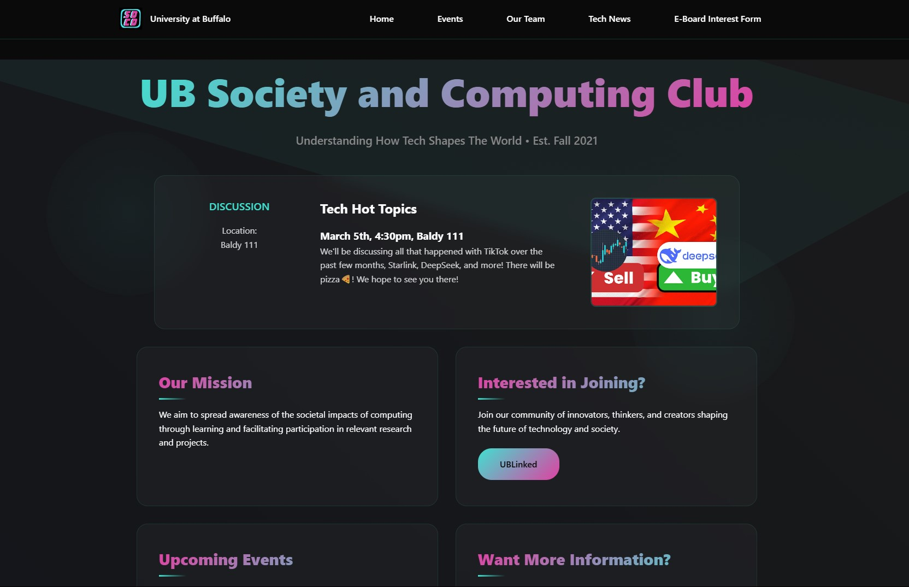
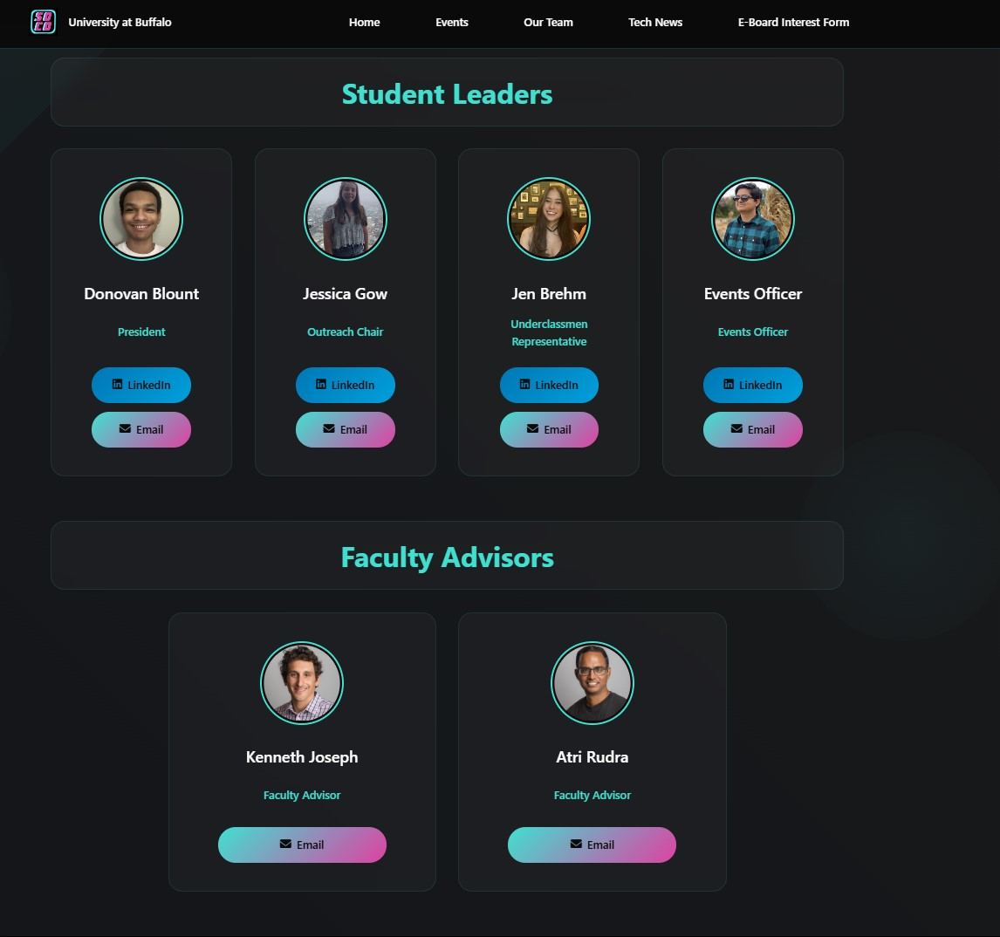

# UB Society and Computing Club Website

A modern informational website for the University at Buffalo Society and Computing Club (UB SoCo), designed to increase visibility and awareness.

<div align="center">
  <h3>Homepage</h3>
  
  
  <h3>Events Page</h3>
  
  
  <h3>Our Team Page</h3>
  
</div>

## Project Structure

```
├── index.html              # Homepage
├── events.html             # Events listing page
├── team.html               # Team members page
├── news.html               # Tech news page
├── styles/                 # CSS files organized by component
│   ├── reset.css           # CSS reset and variables
│   ├── animations.css      # Animation keyframes
│   ├── navbar.css          # Navigation styling
│   ├── layout.css          # Layout structure
│   ├── components.css      # Reusable UI components
│   ├── events.css          # Events page specific styles
│   ├── team.css            # Team page specific styles
│   └── news.css            # News page specific styles
├── src/                    # Assets
│   ├── SoCo_logo.png       # Club logo
│   ├── favicon.ico         # Site favicon
│   ├── events_src/         # Event images
│   └── news_src/           # News article thumbnails
└── js/
    └── main.js             # JavaScript functionality
```

## CSS Structure

- **reset.css**: CSS reset, variables, base styles
- **animations.css**: Animation keyframes for various elements
- **navbar.css**: Navigation bar styling and responsive adjustments
- **layout.css**: Main layout containers and structure
- **components.css**: Reusable UI components like cards, buttons, and titles
- **Page-specific CSS**: Separate files for specialized page layouts

## Technologies Used

- **HTML5**: Semantic markup
- **CSS3**: Modern CSS features including:
  - CSS Grid & Flexbox
  - Custom properties (variables)
  - CSS animations
  - Backdrop filters
  - Media queries
- **JavaScript**: For interactive elements
- **Font Awesome**: For icons

## Local Development

To work with this project locally:
```
git clone https://github.com/SameerJain/soco-website.git
```

## Credits

- Design & Development: Sameer Jain
- Logo and Branding: UB SoCo
